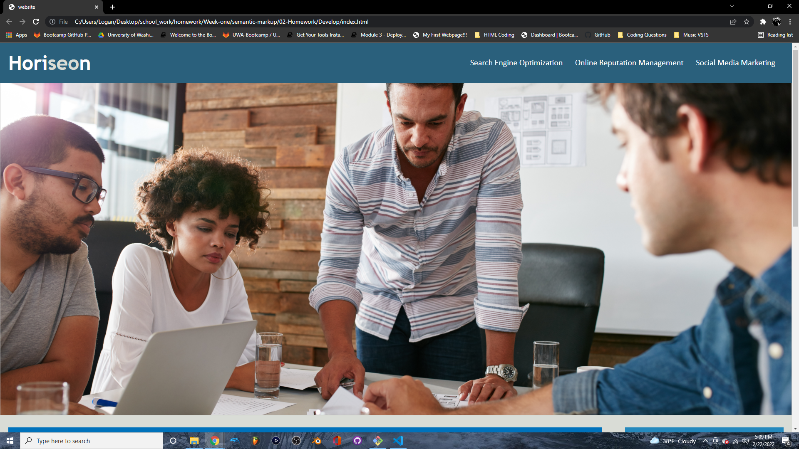
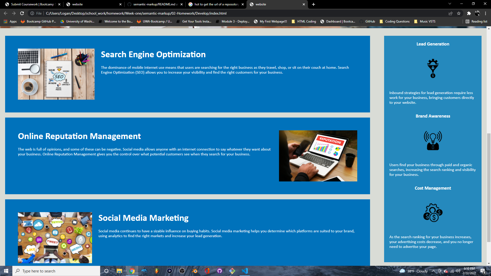

# Horiseon_Social_Solution_Services

**Description**
   
 For this project, we were tasked with editing the code for a mock-company's website, "Horiseon: Social Solution Services"; a step-by-step process to make your brand grow via social media and traditional web-browsing.
 Our task from this company was to make their website more accessibile, so that people that use assistive technologies--such as video captions, screen readers, and braille keyboards--are able to access and navigate their webpage.
    
**What We Need to Do**

For this task, we need to do two things:

> **Refactor**: We need to update/pare down the existing code, *without changing the actual layout* of the page!

> **Semantics**: Replace the *vague* HTML elements (div, for example) to *semantic* elements; making it easier for the website to be navigated by not only people with disabilities, but also search engines!

**The Webpage**

**What We Changed in HTML**

1. We replaced all the 'div' tags to 'header', 'navigation', 'section/article', and 'footer'.
2. We added 'alt' tags to the images (save for the one background image), so that people using screen readers can interpret what the pictures represent.
3. Updated the 'navigation' bar, so that the links actually take you to the desired article.

**What We Changed in CSS**

1. We combined redundant "class" modifiers into singular functions, in order to pare down the length of our page.
2. We replaced the names of the "class" functions, in order to convey their role in the code better.

**Credits**

-Logan Monson
-scarletfedora@gmail.com